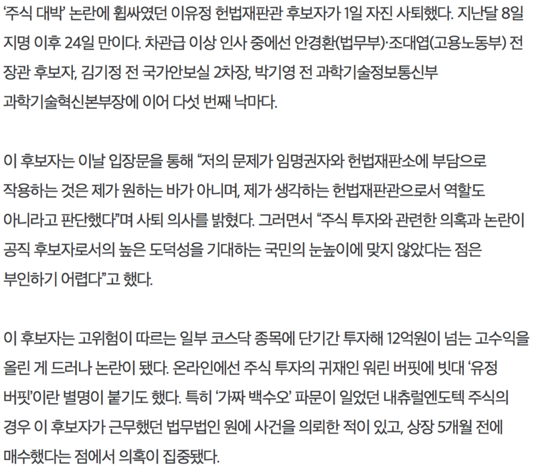

# OCR

[OCR](https://en.wikipedia.org/wiki/Optical_character_recognition) 이라는 단어는 아마도 상당히 오래전부터 나온 용어로 생각됩니다.
어쩌면 JPEG, PNG 등등의 이미지 디지털 포맷이 나오면서 부터 계속해서
글자인식이란 요구가 계속 있어왔다고 보여집니다.

## tesseract

파이썬으로 한글 OCR이 있는가 살펴보다가,
오픈소스로 [tesseract (뜻:4차원육면체)](https://en.wikipedia.org/wiki/Tesseract_(software)) 라는 것이 있다는 것을 알았습니다.

### 역사

간단한 역사를 살펴보니, 휴렛패커드 (Hewlett-Packard Co) 사의 Greeley Colorado라는 사람이
1985~1994 동안 연구를 하였고, 1996년에 윈도우로 포팅되었고, 1998년에 C++ 화 되었다고
나오네요.

이를 2005년에 HP가 오픈소스로 변경하였고, 2006년 부터는 구글에서 개발됩니다.

올해(2017) 6월1일에 3.05에서 4.0 알파버전이 나왔는데
도움말을 보니 4.0에서 한글이 좀더 제대로 OCR를 하기 시작하였다고 하네요.
(아래에 버전 3과 4의 차이를 보여드리겠습니다)

### 컨테이너
위의 내용을 다음과 같이 dockerize 합니다.

``` dockerfile
FROM ubuntu:16.04
MAINTAINER MoonChang Chae <mcchae@gmail.com>

RUN echo "deb http://ppa.launchpad.net/alex-p/tesseract-ocr/ubuntu xenial main\ndeb-src http://ppa.launchpad.net/alex-p/tesseract-ocr/ubuntu xenial main " >> /etc/apt/sources.list \
    && apt-key adv --keyserver keyserver.ubuntu.com --recv-keys CEF9E52D \
    && apt-get update \
    && apt-get install tesseract-ocr -y \
    && apt-get install tesseract-ocr-kor -y \
    && apt-get install tesseract-ocr-jpn -y

CMD ["tesseract"]
```

### 테스트 이미지

테스트 이미지는 아래와 같은 이미지를 이용했습니다.



#### 버전3

버전 3으로 돌린 위의 이미지 판독 결과입니다.

```
$ tesseract -v
tesseract 3.05.01
 leptonica-1.74.4
  libjpeg 9b : libpng 1.6.32 : libtiff 4.0.8 : zlib 1.2.8

$ tesseract ocr_test_kor.png stdout -l kor
흔주식 대박 논료뻬 핍싸였던 이유정 헌볍재판관 후보폈까 1일 폈꾼진 ^꾼토|했다 지뇨찔 8일
지명 이후 24일 묘괌0|다 궂관관급 이상 인사 중에선 안경햄볍무-부)~조대엽(고용노동부) 전
장관 후보자 김기정 전 국7}안보실 2궂}장" 박7 |영 전 과학7 |술정보통신부

과학7 |술혁신본부그츠뻬 이어 드꾼섯 번째 늬띠뿐뇨

이 후보폈괌는 이날 입장문욜 통해 쪄의 문저|가 임명권폈괌와 헌볍재판소에 부담으로
작용눔}는 것은 제가 원듐논 닌괌가 아니며′ 제가 생깁탕훔는 헌볍재판관으로서 역힐도
아니끈괌고 표챤단했대며 썽괌퇴 의^}를 분괌혔다 그러면서 “주식 투폈넵 표뮌한 의흑과 논료뻬
공직 후보×꾼로^1의 높은 도덕성욜 기대듐눈 국민의 눈높이에 맞지 잃'았드빤는 점은
부인눔끼 어렵대고 했다

이 후보폈빤는 고우|혐이 뜨괌르는 일부 코스닥 종목어| 단7|간 투폈빼 12억원이 넘는 고수익욜
올린 게 드러나 논료삐 됐다 온라인에선 주식 투폈빤의 귀재인 워린 버팟에 빗대 。유정
버팟'이란 별명이 붙기도 했다 특히 。7}짜 백수오' 끄빤문이 일었던 내츄렬엔도텍 주식의
경우 이 후보폈꾼가 근무했던 볍무볍인 원에 ^빤건욜 의뢰한 적이 았고~ 상장 57|1월 전에
매수했드꾼는 점에서 의흑이 집중됐^다
```

#### 버전 4

```
$ docker run -it --rm -v ${PWD}/ocr_test_kor.png:/tmp/ocr.png mcchae/tesseract tesseract /tmp/ocr.png stdout -l kor

주 식 대 박 논 란 에 휩 싸 였던 이유정 헌 법 재판관 후 보 자 가 １ 일 자진 사 퇴 했 다 ． 지난달 8 일
지명 이후 ２4 일 만 이 다 ． 차관급 이상 인사 중에선 안 경 환 （ 법 무 부 )- 조 대 엽 （ 고 용 노동부) 전
장 관 후보자, 김 기 정전 국 가 안 보 실 ２ 차 장, 박 기 영 전 과 학 기 술 정 보 통 신부

과 학 기 술 혁 신 본 부 장 에 이어 다섯 번 째 낙 마 다 ．

이 후 보 자 는 이날 입 장 문 을 통해 ＂ 저 의 문 제 가 임 명 권 자 와 헌 법 재 판 소 에 부 담 으로

작 용 하는 것 은 제 가 원 하는 바가 아니며, 제가 생 각 하는 헌 법 재 판 관 으로서 역 할 도

아 니 라 고 판 단 했 다 ＂ 며 사퇴 의 사 를 밝 혔 다 ． 그러면서 ` 주 식 투 자 와 관련한 의 혹 과 논 란 이
공직 후 보 자 로서의 높은 도 덕 성 을 기 대 하는 국 민 의 눈 높 이 에 맞지 않았다는 점 은

부 인 하기 어 렵 다 ＂ 고 했 다 ．

이 후 보 자 는 고 위 험 이 따르는 일부 코 스 닥 종 목 에 단기간 투 자 해 １２ 억 원이 넘 는 고 수 익 을
올 린 게 드 러 나 논 란 이 됐다 온 라 인 에선 주식 투 자 의 귀 재 인 위 린 버 핏 에 빗대 ` 유 정

버 팟 이란 별 명 이 붙 기 도 했 다 ． 특히 ` 가 짜 백 수 오 파 문 이 일 었던 내 츄 럴 엔 도 텍 주 식 의
경우 이 후 보 자 가 근 무 했던 법 무 법인 원 에 사 건 을 의 뢰 한적이 있고, 상장 ５ 개 월 전에

매 수 했다는 점 에서 의 혹 이 집 중 됐다,
```

## 참고
[해당 블로그 참고](http://mcchae.egloos.com/11272572)
