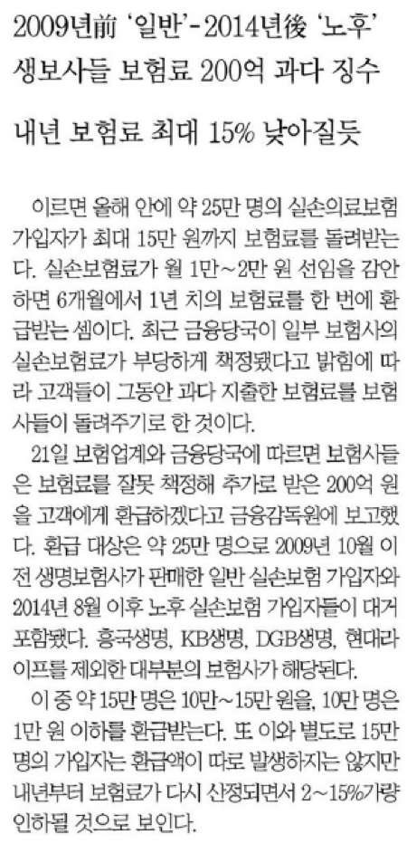

# OCR

[OCR](https://en.wikipedia.org/wiki/Optical_character_recognition) 이라는 단어는 아마도 상당히 오래전부터 나온 용어로 생각됩니다.
어쩌면 JPEG, PNG 등등의 이미지 디지털 포맷이 나오면서 부터 계속해서
글자인식이란 요구가 계속 있어왔다고 보여집니다.

## tesseract

파이썬으로 한글 OCR이 있는가 살펴보다가,
오픈소스로 [tesseract (뜻:4차원육면체)](https://en.wikipedia.org/wiki/Tesseract_(software)) 라는 것이 있다는 것을 알았습니다.

### 역사

간단한 역사를 살펴보니, 휴렛패커드 (Hewlett-Packard Co) 사의 Greeley Colorado라는 사람이
1985~1994 동안 연구를 하였고, 1996년에 윈도우로 포팅되었고, 1998년에 C++ 화 되었다고
나오네요.

이를 2005년에 HP가 오픈소스로 변경하였고, 2006년 부터는 구글에서 개발됩니다.

올해(2017) 6월1일에 3.05에서 4.0 알파버전이 나왔는데
도움말을 보니 4.0에서 한글이 좀더 제대로 OCR를 하기 시작하였다고 하네요.
(아래에 버전 3과 4의 차이를 보여드리겠습니다)

### 컨테이너
최근 (2018년 6월 15일) 까지 `Ubuntu 16.04 에서`에서 아래와 같이 직접 쉽게 설치를 했습니다만, 이를 alpine에서 해 보기로 마음 먹었습니다.

``` dockerfile
FROM ubuntu:16.04
MAINTAINER MoonChang Chae <mcchae@gmail.com>

RUN echo "deb http://ppa.launchpad.net/alex-p/tesseract-ocr/ubuntu xenial main\ndeb-src http://ppa.launchpad.net/alex-p/tesseract-ocr/ubuntu xenial main " >> /etc/apt/sources.list \
    && apt-key adv --keyserver keyserver.ubuntu.com --recv-keys CEF9E52D \
    && apt-get update \
    && apt-get install tesseract-ocr -y \
    && apt-get install tesseract-ocr-kor -y \
    && apt-get install tesseract-ocr-jpn -y

CMD ["tesseract"]
```

그 전에 우선 우분에 16.04에서 소스로 build 하는 것을 해 보았더니 다음과 같은 shell script가 나왔습니다.

```sh
#!/bin/bash

###############################################################################
# build tesseract from source
###############################################################################

# 1) packages for building source
sudo apt-get install -y autoconf automake libtool
sudo apt-get install -y autoconf-archive
sudo apt-get install -y pkg-config
sudo apt-get install -y libpng12-dev
sudo apt-get install -y libjpeg8-dev
sudo apt-get install -y libtiff5-dev
sudo apt-get install -y zlib1g-dev

# if you plan to install the training tools, you also need the following libraries
#sudo apt-get install -y libicu-dev
#sudo apt-get install -y libpango1.0-dev
#sudo apt-get install -y libcairo2-dev

# 2) build Leptonica
if [ ! -e /usr/local/lib/liblept.so ];then
	if [ ! -d leptonica-1.76.0 ];then
		wget http://www.leptonica.org/source/leptonica-1.76.0.tar.gz
		tar xvfz leptonica-1.76.0.tar.gz
	fi
	pushd leptonica-1.76.0
		./configure
		make
		sudo make install
	popd
fi

# 3) build tesseract
which tesseract
if [ $? -ne 0 ];then
	if [ ! -e tesseract ]; then
		git clone --depth 1 https://github.com/tesseract-ocr/tesseract.git
	fi
	pushd tesseract
		./autogen.sh
		./configure --enable-debug
		LDFLAGS="-L/usr/local/lib" CFLAGS="-I/usr/local/include" make
		sudo make install
		sudo ldconfig
	popd
fi

# 4) tesseract language data
export TESSDATA_PREFIX=/usr/local/share
if [ ! -d $TESSDATA_PREFIX/tessdata ]; then
	sudo mkdir -p $TESSDATA_PREFIX/tessdata
fi

LANS="eng
kor
jpn
chi_tra
"
LAN_TYPE="best"
#LAN_TYPE="fast"
while read -r LAN; do
	if [ ! -e $TESSDATA_PREFIX/tessdata/$LAN ];then
		wget https://github.com/tesseract-ocr/tessdata_$LAN_TYPE/raw/master/$LAN.traineddata
		sudo mv -f $LAN.traineddata $TESSDATA_PREFIX/tessdata/$LAN.traineddata
	fi
done <<< "$LANS"
```

자 이제는 쉽겠지.. 하며 alpine에 도전해 봅니다.

약 이틀의 시간이 소요된 듯 합니다만,
결국은 다음과 같은 Dockerfile 을 완성했습니다.

> 역시 dockerize은 쉘스크립트의 부단한 시행착오라 다시 한번 느껴봅니다.

```sh
#FROM mcchae/sshd-x
FROM alpine
MAINTAINER MoonChang Chae mcchae@gmail.com
LABEL Description="alpine tesseract 4.x"

ADD autogen.sh configure /tmp/

WORKDIR /tmp
RUN apk --update add --virtual build-dependencies alpine-sdk automake autoconf libtool \
		libpng-dev libjpeg-turbo-dev tiff-dev zlib-dev wget git \
# for Leptonica
	&& wget -q http://www.leptonica.org/source/leptonica-1.76.0.tar.gz \
	&& tar xvfz leptonica-1.76.0.tar.gz \
	&& cd leptonica-1.76.0 \
	&& ./configure \
	&& make \
	&& make install \
	&& cd .. \
	&& rm -rf leptonica* \
# for tesseract
	&& git clone --depth 1 https://github.com/tesseract-ocr/tesseract.git \
	&& cd tesseract \
	&& mv /tmp/autogen.sh . && chown root:root autogen.sh \
	&& ./autogen.sh \
	&& cp /tmp/configure . && chown root:root configure \
	&& ./configure --enable-debug \
	&& LDFLAGS="-L/usr/local/lib" CFLAGS="-I/usr/local/include" make \
	&& make install \
#	&& ldconfig \
	&& cd .. \
	&& rm -rf tesseract* \
	&& apk del build-dependencies

#  next shared libraries is need for running libtesseract.so
ADD lib.tgz /tmp/
RUN	mv -f /tmp/lib/* /usr/lib \
	&& rm -rf /tmp/lib /tmp/configure

# for tesseract data
ENV TESSDATA_PREFIX /usr/local/share/tessdata
ENV LAN_TYPE best
#ENV LAN_TYPE fast
WORKDIR /
RUN apk --update add wget \
	&& wget -q -P $TESSDATA_PREFIX https://github.com/tesseract-ocr/tessdata_$LAN_TYPE/raw/master/eng.traineddata \
	&& wget -q -P $TESSDATA_PREFIX https://github.com/tesseract-ocr/tessdata_$LAN_TYPE/raw/master/kor.traineddata \
	&& wget -q -P $TESSDATA_PREFIX https://github.com/tesseract-ocr/tessdata_$LAN_TYPE/raw/master/jpn.traineddata \
	&& wget -q -P $TESSDATA_PREFIX https://github.com/tesseract-ocr/tessdata_$LAN_TYPE/raw/master/chi_tra.traineddata

CMD ["tesseract"]
```

고생했던 부분은 `apk del build-dependencies` 를 하고 나서 필요한 공유 라이브러리가 사라진다는 것인데 다음과 같은 것들이었고, 이를 `apk del build-dependencies` 하지 않고 build한 결과에 따라 필요한 것을 찾아 lib.tgz 로 묶어서 넣어 줬다는 것입니다.

그 라이브러리는 /usr/lib에 있는 다음과 같은 것들입니다.

```sh
drwxr-xr-x  0 mcchae staff       0  6 20 16:35 lib/
lrwxr-xr-x  0 mcchae staff       0  6 20 16:32 lib/libstdc++.so.6 -> libstdc++.so.6.0.22
-rwxr-xr-x  0 mcchae staff  186160  6 20 16:35 lib/libpng16.so.16.34.0
lrwxr-xr-x  0 mcchae staff       0  6 20 16:32 lib/libstdc++.so -> libstdc++.so.6.0.22
lrwxr-xr-x  0 mcchae staff       0  6 20 16:35 lib/libpng16.so.16 -> libpng16.so.16.34.0
-rwxr-xr-x  0 mcchae staff  424224  6 20 16:35 lib/libtiff.so.5.3.0
-rw-r--r--  0 mcchae staff   71400  6 20 16:33 lib/libgcc_s.so.1
-rwxr-xr-x  0 mcchae staff  137480  6 20 16:34 lib/libgomp.so.1.0.0
lrwxr-xr-x  0 mcchae staff       0  6 20 16:35 lib/libpng16.so -> libpng16.so.16.34.0
lrwxr-xr-x  0 mcchae staff       0  6 20 16:35 lib/libjpeg.so -> libjpeg.so.8.1.2
-rwxr-xr-x  0 mcchae staff 1370496  6 20 16:32 lib/libstdc++.so.6.0.22
-rwxr-xr-x  0 mcchae staff  386872  6 20 16:35 lib/libjpeg.so.8.1.2
lrwxr-xr-x  0 mcchae staff       0  6 20 16:34 lib/libgomp.so.1 -> libgomp.so.1.0.0
lrwxr-xr-x  0 mcchae staff       0  6 20 16:35 lib/libtiff.so.5 -> libtiff.so.5.3.0
lrwxr-xr-x  0 mcchae staff       0  6 20 16:35 lib/libjpeg.so.8 -> libjpeg.so.8.1.2
lrwxr-xr-x  0 mcchae staff       0  6 20 16:34 lib/libgomp.so -> libgomp.so.1.0.0
-rw-r--r--  0 mcchae staff     132  6 20 16:33 lib/libgcc_s.so
lrwxr-xr-x  0 mcchae staff       0  6 20 16:35 lib/libtiff.so -> libtiff.so.5.3.0
```

한가지 유의할 것은 `LAN_TYPE`을 정의하였는데, `best` 또는 `fast` 중에 하나를 지정할 수 있습니다. 이것은 해당 OCR 데이터가 정확도를 우선으로 하는가 아니면 속도를 우선으로 하는가의 차이가 있습니다. 

### 테스트 이미지

테스트 이미지는 아래와 같은 이미지를 이용했습니다.



#### 버전3

버전 3으로 돌린 위의 이미지 판독 결과입니다.

```
$ tesseract -v
tesseract 3.05.01
 leptonica-1.74.4
  libjpeg 9b : libpng 1.6.32 : libtiff 4.0.8 : zlib 1.2.8

$ tesseract ocr_test_kor.png stdout -l kor
흔주식 대박 논료뻬 핍싸였던 이유정 헌볍재판관 후보폈까 1일 폈꾼진 ^꾼토|했다 지뇨찔 8일
지명 이후 24일 묘괌0|다 궂관관급 이상 인사 중에선 안경햄볍무-부)~조대엽(고용노동부) 전
장관 후보자 김기정 전 국7}안보실 2궂}장" 박7 |영 전 과학7 |술정보통신부

과학7 |술혁신본부그츠뻬 이어 드꾼섯 번째 늬띠뿐뇨

이 후보폈괌는 이날 입장문욜 통해 쪄의 문저|가 임명권폈괌와 헌볍재판소에 부담으로
작용눔}는 것은 제가 원듐논 닌괌가 아니며′ 제가 생깁탕훔는 헌볍재판관으로서 역힐도
아니끈괌고 표챤단했대며 썽괌퇴 의^}를 분괌혔다 그러면서 “주식 투폈넵 표뮌한 의흑과 논료뻬
공직 후보×꾼로^1의 높은 도덕성욜 기대듐눈 국민의 눈높이에 맞지 잃'았드빤는 점은
부인눔끼 어렵대고 했다

이 후보폈빤는 고우|혐이 뜨괌르는 일부 코스닥 종목어| 단7|간 투폈빼 12억원이 넘는 고수익욜
올린 게 드러나 논료삐 됐다 온라인에선 주식 투폈빤의 귀재인 워린 버팟에 빗대 。유정
버팟'이란 별명이 붙기도 했다 특히 。7}짜 백수오' 끄빤문이 일었던 내츄렬엔도텍 주식의
경우 이 후보폈꾼가 근무했던 볍무볍인 원에 ^빤건욜 의뢰한 적이 았고~ 상장 57|1월 전에
매수했드꾼는 점에서 의흑이 집중됐^다
```

#### 버전 4

```
$ docker run -it --rm -v ${PWD}/ocr_test_kor.png:/tmp/ocr.png mcchae/tesseract tesseract /tmp/ocr.png stdout -l kor

주식 대박" 논 란 에 싸 였던 이유정 헌 법 재판관 후 보 자 가 1 일 자진 사 퇴 했다. 지난달 8 일
지명 이후 24 일 만 이 다. 차관급 이상 인사 중에선 안 경 환 ( 법 무 부 ) 조 대 엽 ( 고 용 노동부) 전
장관 후보자 김기정 전 국 가 안 보 실 2 차 장 , 박기영 전 과 학 기 술 정 보 통 신부

과 학 기 술 혁 신 본 부 장 에 이어 다섯 번째 낙 마 다.

이 후 보 자 는 이날 입 장 문 을 통해 "저의 문 제 가 임 명 권 자 와 헌 법 재 판 소 에 부 담 으로
작 용 하는 것은 제가 원하는 바가 아니며 제가 생 각 하는 헌 법 재 판 관 으로서 역 할 도
아니라고 판 단 했 다 " 며 사퇴 의 사 를 밝혔다. 그러면서 주식 투 자 와 관련한 의 혹 과 논 란 이
공직 후 보 자 로서의 높은 도 덕 성 을 기 대 하는 국 민 의 눈 높 이 에 맞지 않았다는 점 은

부 인 하기 어 렵 다 "고 했다.

이 후 보 자 는 고 위 험 이 따르는 일부 코스닥 종 목 에 단기간 투 자 해 12 억 원 이 넘는 고 수 익 을
올린 게 드러나 논 란 이 됐다: 온 라 인 에선 주식 투 자 의 귀 재 인 워 린 버 핏 에 빗대 유정

버 펫 ' 이 란 별 명 이 붙 기 도 했다. 특히 가짜 백 수 오 ' 파 문 이 일 었던 내 츄 럴 엔 도 텍 주 식 의
경우 이 후 보 자 가 근 무 했던 법 무 법인 원 에 사 건 을 의 뢰 한 적이 있고, 상장 5 개 월 전에

매 수 했다는 점 에서 의 혹 이 집 중 됐다.
```

## 참고
[해당 블로그 참고](http://mcchae.egloos.com/11272572)
